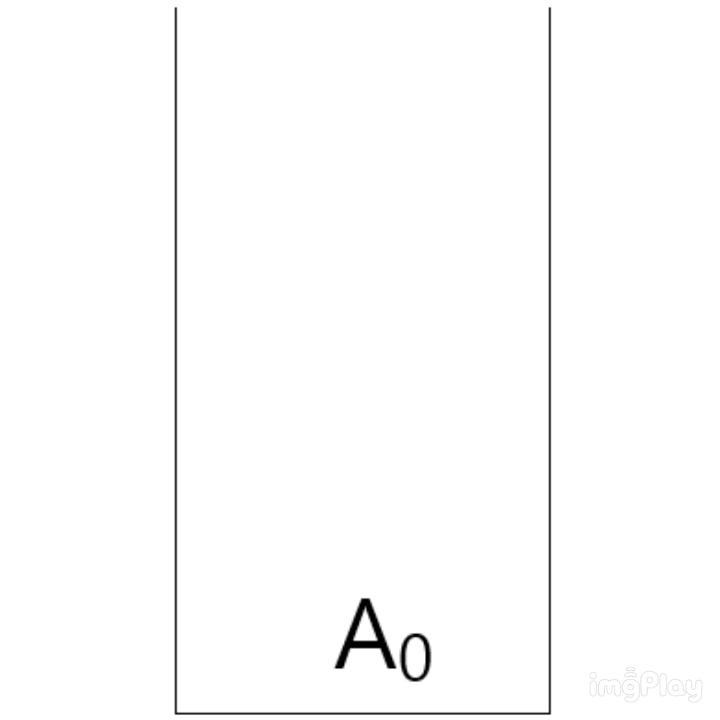
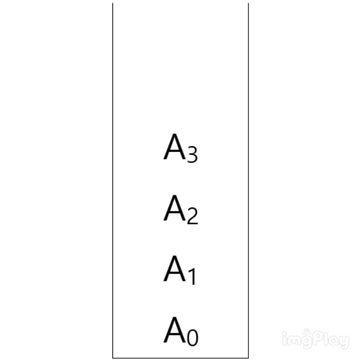

# Data_Structure
자료구조
>- <a href="#array">배열</a>  
>- <a href="#stack">스택</a>


<br>
<br>

# <div id="array">배열</div>
## 정의
> Array(배열) : 한 종류의 데이터 타입을 연속적으로 메모리에 저장한 집합이다.
```
int array[10] = {0,1,2,3,4,5,6,7,8,9};
```

예를 들어 int 타입 데이터 10개를 연속적인 메모리에 저장하게 해주는 것이 배열이다.
<br>  
<br>


## 특징  

### 인덱스[index]
>이러한 배열은 인덱스[index]를 통해 배열의 요소{0,1,2...}에 접근할 수 있다.
```
printf("%d",array[0]); // 0을 출력한다.
printf("%d",array[1]); // 1을 출력한다.
printf("%d",array[2]); // 2를 출력한다.
```

배열의 인덱스는 항상 0부터 시작 한다.  
따라서 array 변수의 경우, 10개의 int 타입 데이터를 가지고 있기 때문에 인덱스는 0부터 9까지이다.  
<br>
<br>
### 배열의 내부
>일반 변수와 달리 배열 변수 안에는 배열이 시작하는 지점의 메모리 주소를 가진다.
```
printf("%p", array); // 00B8FA70 메모리 위치 출력(16진수)
```

따라서  
0의 메모리 위치는 00B8FA70  
1의 메모리 위치는 00B8FA74  
2의 메모리 위치는 00B8FA78  
...  
<br>  
<br>
## 생각
>다른 자료 구조들에 비해 배열의 유일한(?) 특징은 [연속적인 메모리 위치]라고 생각한다. 다른 자료 구조들의 경우 데이터가 나란히 이어져 있는 경우는 있지만, 물리적으로 메모리가 이어져 있는 경우는 (내가 알기론) 없기 때문이다.
___
<br>
<br>
<br>
<br>

# <div id="stack">스택</div>
## 정의
>Stack(스택) : 탑(top)에 의해 삽입과 삭제가 이루어지는 정렬된 리스트  

<br>
<br>

## 특징
>스택은 쉽게 말해 상자 쌓기와 비슷하다.  
 
 창고에서 상자를 정리하기 위해서는 맨 처음에 상자를 바닥에 두고, 그 다음 상자를 위에 올린다.  

이와같이 데이터가 아래부터 위로 쌓아 올라가는 듯한 형태의 자료구조가 스택이다. 이 때 가장 최근에 삽입된 데이터를 탑(Top)이라고 부르며 데이터가 삽입(push) 및 삭제(pop)될 때 항상 탑을 기준으로 작동한다.  
 
비어있는 스택에 데이터 A0가 삽입되면 A0가 탑이 된다.  
이후에 데이터 A1이 삽입되면 탑(A0) 위에 A1이 쌓이면서 A1이 탑이된다.  
  
<br>
반대로 스택에 쌓인 데이터를 삭제한다면 맨 위에 쌓여있는 데이터 부터 즉, 가장 최근에 삽입된 데이터(A4) 먼저 삭제된다.   
  

이러한 특징을 **LIFO(Last In First Out)** 라고 부른다.   
**가장 최근에 들어온 데이터가 먼저 나가는 특징을 가지고 있다.**  

<br>
<br>

## 생각
>스택은 대표적으로 미로찾기 알고리즘,후위식 및 전위식 계산에 쓰이는 자료구조 이다.