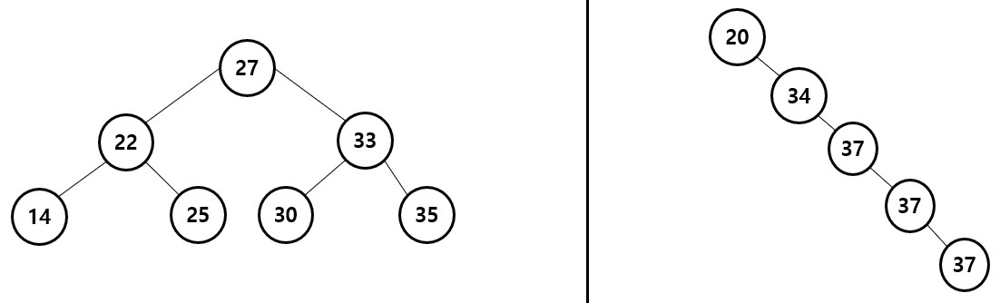

# Data_Structure
자료구조
>- <a href="#array">배열</a> 
>- <a href="#list">리스트</a> 
>- <a href="#stack">스택</a>
>- <a href="#queue">큐</a>
>- <a href="#tree">트리</a>
>   - <a href="#binary_tree">이진 트리</a>
>   - <a href="#full_binary_tree">포화 이진 트리</a>
>   - <a href="#complete_binary_tree">완전 이진 트리</a>
>   - <a href="#binary_tree_traversal">이진 트리 순회</a>
>   - <a href="#max_heap">최대 힙</a>
>   - <a href="#binary_search_tree">이진 탐색 트리</a>
> 
> 
> 

<br>
<br>

# <div id="array">배열(Array)</div>  
## 정의
 Array(배열) : 한 종류의 데이터 타입을 연속적으로 메모리에 저장한 집합이다.
```
int array[10] = {0,1,2,3,4,5,6,7,8,9};
```

예를 들어 int 타입 데이터 10개를 연속적인 메모리에 저장하게 해주는 것이 배열이다.
<br>  
<br>


## 특징  

### 인덱스[index]
배열은 `인덱스[index]`를 통해 배열의 요소{0,1,2...}에 접근할 수 있다.  
이는 물리적으로 순서가 연결되어 있기 때문이다.  

```
printf("%d",array[0]); // 0을 출력한다.
printf("%d",array[1]); // 1을 출력한다.
printf("%d",array[2]); // 2를 출력한다.
```

배열의 인덱스는 항상 0부터 시작 한다.  
따라서 array 변수의 경우, 10개의 int 타입 데이터를 가지고 있기 때문에 인덱스는 0부터 9까지이다.  
배열은 물리적으로 순서가 연결되어 있기 때문에, 인덱스를 통해 O(1)의 시간복잡도로 해당 요소에 접근이 가능하다.  
<br>
일반 변수와 달리 배열 변수 안에는 배열이 시작하는 지점의 메모리 주소를 가진다.
```
printf("%p", array); // 00B8FA70 메모리 위치 출력(16진수)
printf("%d", sizeof(int)); // int는 4 byte
```

따라서  
0의 메모리 위치는 00B8FA70  
1의 메모리 위치는 00B8FA74  
2의 메모리 위치는 00B8FA78  
...  

<br>  
<br>

## 생각
>다른 자료 구조들에 비해 배열의 유일한(?) 특징은 [연속적인 메모리 위치]라고 생각한다. 다른 자료 구조들의 경우 데이터가 나란히 이어져 있는 경우는 있지만, 물리적으로 메모리가 이어져 있는 경우는 (내가 알기론) 없기 때문이다.
____________________________________________________________________________
<br>
<br>
<br>
<br>

# <div id="list">리스트(List)</div>
## 정의
List(리스트) : n개의 데이터 타입이 서로 연결되어 순서가 있다.  
리스트의 각각의 요소들이 서로 연결되어져 있다.  

<br>

## 특징
리스트는 아래와 같이 2가지로 구현할 수 있다.
1. 배열  
2. 연결 리스트

<br>
<br>

 ## 1. 배열(Array)
배열의 경우 구현이 간단하지만  
삽입,삭제시 때에 따라 리스트의 순서를 유지하기 위해 배열의 많은 요소들을 하나씩 옮겨야 하기 때문에 비효율적이다.  
또한 배열을 선언한 이후에, 크기를 늘리거나 줄일 수 없는 정적인(static) 형태를 가지고 있다.  

C언어의 경우 일반적인 지역변수나 배열은 Stack이라는 메모리에 저장이 된다.  
이 Stack에 저장된 변수는 프로그램이 종료되면 자동적으로 메모리가 해제된다. 

> ### 삽입
>    
B와 D 사이에 C를 삽입하기 위해 D름 포함하여 뒤에 있는 모든 데이터를 옮겨야 한다.    
  
  <br>
  <br>

> ### 삭제  
>  
C를 삭제했다면, 서로 연결되어 지기 위해 , D를 포함한 뒤에 있는 모든 데이터를 옮겨야 한다.  

<br>
<br>

## 2. 연결 리스트(LinkedList)
연결 리스트의 경우 구현이 복잡하지만 삽입,삭제가 효율적이고  
프로그램 사용 도중 유동적으로 리스트의 크기를 줄이고 늘릴 수 있는 동적인(dynamic) 형태를 가진다.  
C언어의 경우 Heap 영역에 메모리를 할당하여 사용한다.  

연결 리스트의 경우 __노드(Node)__ 를 하나 생성하여 노드간에 서로 연결지어 준다.  
노드는 1. 데이터 필드 2. 링크 필드로 구성되어 진다.
1. 데이터 필드(Data Field) : 데이터를 저장하는 공간  
2. 링크 필드 (Link Field) : 다른 노드의 주소 값을 저장하는 장소
   
아래는 C 언어에서의 노드를 구성하는 구조체 이다.  
```
typedef struct _Node{
    int data; // 데이터 필드
    struct _Node* next; // 링크 필드
}Node;
```
>노드 간 연결    
  

이와 같이 노드에 데이터가 저장되며, 자기 자신에 대한 포인터를 사용하여 노드간에 서로 연결 시킨다.  
연결 리스트는 이 구조체에 Heap 메모리를 할당하여 랜덤한 위치의 메모리를 사용한다. 때문에 노드간에 물리적으로 연결되어 있지는 않다.  
하지만 다음 노드에 대한 주소를 가지고 있으므로 __논리적으로 순서가 연결__ 되어 있다.  
때문에 원하는 데이터를 탐색(Search)하기 위하여 모든 노드의 갯수(n)만큼 탐색하기 때문에 O(n)의 시간복잡도를 가진다. 
<br>
<br>
Heap에 메모리를 할당하였다면, **프로그램이 종료되기 전에 반드시 적절한 메모리 해제 명령어를 작성해야 한다.**  
그렇지 않으면, 사용중인 메모리는 프로그램이 종료 되어도 사라지지 않는다. 따라서 메모리를 해제해 주지 않는다면  
우리는 다음번에 해당 위치의 메모리를 사용할 수 없다. 이러한 현상을 <span style="color:powderblue">**메모리 누수 현상**</span>이라고 부른다.  

이 메모리 누수 현상이 쌓이다 보면, 더 이상 메모리를 사용할 수 없게되어 프로그램이 다운되고 만다. 그러니
각별히 신경써야 한다.   
때문에 Java 같은 언어에서는 Garbage Collect라는 메모리 관리 시스템을 가지고 있어, 사람이 신경쓰지 않아도 자동적으로  
메모리를 해제하여 메모리 누수 현상을 막아준다.  

연결 리스트의 종류는 크게 3가지가 있다.
>1. 단순 연결 리스트(Singly Linked List)  


>2. 원형 연결 리스트(Circular Linked List)  


>3. 아중 연결 리스트(Doubly Linked List)  

______________________________________________________________________________
<br>
<br>
<br>
<br>

# <div id="stack">스택(Stack)</div>
## 정의
Stack(스택) : 탑(top)에 의해 삽입과 삭제가 이루어지는 정렬된 리스트  

<br>
<br>

## 특징
스택은 쉽게 말해 상자 쌓기와 비슷하다.  
 
 창고에서 상자를 정리하기 위해서는 맨 처음에 상자를 바닥에 두고, 그 다음 상자를 위에 올린다.  

이와같이 데이터가 아래부터 위로 쌓아 올라가는 듯한 형태의 자료구조가 스택이다. 이 때 가장 최근에 삽입된 데이터를 탑(Top)이라고 부르며 데이터가 삽입(push) 및 삭제(pop)될 때 항상 탑을 기준으로 작동한다.  
 
비어있는 스택에 데이터 A0가 삽입되면 A0가 탑이 된다.  
이후에 데이터 A1이 삽입되면 탑(A0) 위에 A1이 쌓이면서 A1이 탑이된다.  
  
<br>
반대로 스택에 쌓인 데이터를 삭제한다면 맨 위에 쌓여있는 데이터 부터 즉, 가장 최근에 삽입된 데이터(A4) 먼저 삭제된다.   
  

이러한 특징을 **LIFO(Last In First Out)** 라고 부른다.   
**가장 최근에 들어온 데이터가 먼저 나가는 특징을 가지고 있다.**  

<br>
<br>

## 생각
>스택은 대표적으로 미로찾기 알고리즘,후위식 및 전위식 계산에 쓰이는 자료구조 이다.  

____________________________________________________________________________
<br>
<br>
<br>
<br>

# <div id="queue">큐(Queue)</div>

## 정의  
Queue(큐) :  모든 삽입은 한쪽 끝에서 이루어 지고(Rear), 모든 삭제는 반대 한 쪽(Front)에서 이루어 지는 정렬된 리스트이다.  

<br>
<br> 

## 특징
큐는 쉽게말해 '대기 줄' 이다.  
은행 업무를 보기 위해 대기 줄 맨 뒤에서 대기 했다가, 앞에 있는 모든 사람이 업무를 마치고 돌아가면 다음으로 대기하던 사람이 은행 업무를 보게 되는 것이다.  

이때 가장 앞에 있는 사람이 Front, 가장 뒤에 있는 사람이 Rear이다. 데이터를 삽입하면 가장 뒤에(Rear) 데이터가 쌓인다. 반대로 데이터를 삭제를 하면 맨 앞(Front)에서 삭제가 이뤄진다.

> 삽입  
  

> 삭제  
  

따라서 가장 빨린 삽입된 데이터 일 수록, 더 빨리 삭제되고, 가장 늦게 삽입된 데이터 일 수록, 더 늦게 삭제된다.  
이러한 특징을 **FIFO(Fisr In First Out)** 라고 부른다.   
**가장 빨리 들어온 데이터가 먼저 나가는 특징을 가지고 있다.**   

## 생각  


____________________________________________________________________________
<br>
<br>
<br>
<br>


# <div id="tree">트리</div>  

## 정의  
Tree(트리) : 한 개 이상의 노드를 가진 유한한 집합  
트리에는 루트(Root) 노드(Node)라고 불리는 것이 있다.   
>Tree 예시  
  

<br>
<br>  

## 특징  

- 서브트리(SubTree) :   
  

- 트리의 크기(Size of tree) : 노드의 갯수 -> 8 (A B C D E F G H)  
- 노드의 차수(Degree of node) : 서브트리의 갯수 -> A의 경우 2, B의경우 3  
- 트리의 차수(Degree of tree) : 노드의 최대 차수 -> 3 (B)   
<br>

- 트리의 레벨(Level of tree) : 노드의 최대 레벨 -> 루트로 부터 아래 노드로 갈 수록 1씩 증가한다. 루트의 레벨은 0 혹은 1로 가정할 수 있다.   
레벨은 아래 그림과 같이 노드 1개를 의미하는 것이 아니라 가로선상에 동일한 노드 모두를 의미한다.  
 

- 트리의 높이(Height or Depth of a  tree) -> 트리에서 가장 큰 레벨-> 4 (H)   
- 트리의 너비(Width of tree) : 가장 큰 레벨에 있는 노드의 수 -> 1 (H)  

<br>  

- 단말 노드(Terminal Node) : 리프(Leaf)노드 라고 부르기도 하며, 자녀(Childern)가 없는 노드를 의미한다.    
- 비단말 노드(Non-Terminal Node) : 자녀(Childern)를 가지고 있는 노드를 의미한다.   
   

- 부모(parent) : 하나의 노드의 바로 위에 노드 -> B의 부모는 A, D의 부모는 B  
- 자녀(Childern) : 부모 노드의 바로 아래 노드 -> A의 자녀는 B,C , B의 자녀는 D,E,F  
- 형제(Sibling) : 같은 레벨을 가지는 노드 -> D의 형제는 E,F,G  
- 할아버지(Grand parent) : 부모 노드의 부모노드  
- 손자(Grand childern) : 자녀 노드의 자녀노드  
- 조상(Ancestors) : 루트부터 해당 노드까지에 있는 모든 노드 -> H의 조상은 G,C, A    
- 자손(Descendants) : 해당 노드의 서브트리에 해당하는 모든 노드 -> B의 자손은 D,E,F   

<br>

## <div id="binary_tree">이진트리(Binary Tree)  </div>
### 정의
Binary Tree(이진트리)  : 모든 노드의 차수가 2개인 트리, Left child와 Rigth Child를 구분한다.  
왼쪽과 오른쪽 트리 모두 이진트리 이다. 특히 오른쪽 트리는 편향(Skewed)이진 트리라고 부른다.   
  

- 레벨 i 에서 이진트리의 최대 노드 갯수 : 2^(i - 1) (i>=1)-> 레벨 3에서 최대 노드 갯수는 2^(3-1) = 4개 이다.    
- 높이가 h인 이진트리의 최대 노드 갯수 : 2^h - 1 (h>=1)-> 높이가 3일때 최대 노드 갯수는 2^3 - 1 = 7개 이다.

<br>

## <div id="full_binary_tree">포화 이진트리(Full-Binary Tree)  </div>
### 정의  
Full-Binary Tree(포화 이진트리) : 높이가 h이며, 노드의 갯수가 2^h - 1 (h>=0)개인 이진트리, 즉 높이 h까지 모든 노드의 차수가 2로 채워진 트리이다.  


<br> 

## <div id="complete_binary_tree">완전 이진트리(Complete-Binary Tree)  </div>
### 정의  
Complete-Binary Tree(완전 이진트리) : 노드에 번호를 대응하였을 때, 중간에 빠지는 것 없이 차례대로 노드가 있는 이진트리이다.  
  

<br> 

## <div id="binary_tree_traversal">이진트리 순회(Binary Tree Traversal) </div>
<br> 

### 중위식(Inorder)
1. 왼쪽 노드로 이동
1. 해당 노드를 방문(출력 등등)
1. 오른쪽 노드로 이동  


<br> 

### 전위식(Preorder)  
1. 해당 노드를 방문(출력 등등)
1. 왼쪽 노드로 이동
1. 오른쪽 노드로 이동  


<br> 

### 후위식(Postorder)  
1. 왼쪽 노드로 이동
1. 오른쪽 노드로 이동 
1. 해당 노드를 방문(출력 등등)  


<br> 

### 레벨 순서(Level-order) - BFS  
1. 큐에 노드를 저장  
이후에  아래 반복
2. 큐의 Front에서 노드를 가져옴
3. 노드 출력
4. 노드의 Left Child를 큐에 저장
5. 노드의 Right Child를 큐에 저장  


<br>  

## <div id="max_heap">최대 힙(Max Heap) </div>
### 정의  
Max Tree : 부모 노드의 키 값(Key Value) >= 자식 노드의 키 값(Key Value) 인 Tree  
Max Heap(최대 힙) : Max Tree인 **완전 이진트리(Complete binary tree)**  
즉, 부모 노드의 키 값이 자식의 노드 키 값보다 크거나 같은 조건이 성립되는 완전 이진트리를 의미한다.  
  

<br> 

### 삽입(Insertion)  
1. 완전 이진트리의 번호 순서에 맞게 노드를 추가한다.  
이후에 아래를 반복한다.  
2. 추가된 노드와 부모 노드와 값을 비교한다.
3. 부모 노드의 키 값이 더 작다면 서로 교환한다.  
  
Max Heap의 삽입은 새로운 노드가 추가될 때마다 트리의 최대 depth만큼 비교하게 된다.  
따라서 시간복잡도는 O(log_2(n))이다.  (n은 노드의 갯수)
<br> 

### 삭제(Deletion)   
1. 루트 노드의 값을 삭제한다.
2. 완전 이진트리의 가장 마지막 노드의 키 값을 루트 노드로 가져온다.  
이후에 아래를 반복한다.  
3. 가져온 값의 Left Child와 Right Child를 비교하여 큰 키 값을 고른다.  
4. 가져온 값과 Child를 비교하여 child의 키 값이 더 크다면 서로 교환한다.  
  
Max Heap의 삭제는 가장 큰 키 값(루트 노드)부터 제거된다. 따라서 삭제 또한 트리의 최대 depth만큼 비교하기 때문에 시간복잡도는 O(log_2 N)이다.  
하지만 임의의 노드를 삭제하려면 모든 노드를 찾아야 하므로 시간복잡도는 O(n)이 되기 때문에 비효율적이다.    
<br>

## <div id="binary_search_tree">이진 탐색 트리(Binary Search Tree) - BST </div>
### 정의  
탐색(Search)을 위하 이진 트리 이다.  
- 모든 요소는 키(Key)값을 가지며, 중복되지 않는다.  
- 왼쪽 서브트리의 모든 키 값은 루트 노드 키값보다 작다.  
- 오른쪽 서브트리의 모든 키 값은 루트 노드 키값보다 작다.  
- 왼쪽, 오른쪽 서브트리 또한 BST이다.  
  

BST의 중위식은 요소들을 정렬하여 나열하는 것과 같은 효과를 가진다.  
탐색,삽입,삭제는 적어도 O(h)의 시간복잡도를 가진다. (h은 BST의 height)  
<br>
Average Case(평균의 경우) : O(h), h는 BST의 height  
Worst Case(최악의 경우) : O(n), n은 BST의 노드 갯수 (오른쪽)   
Complete BT(완전이진트리) : O(log_2(n)) , (왼쪽)  
  

즉, BST의 형태가 어떠한지에 따라 시간복잡도는 달라진다.  

<br>

### 삽입(Insertion)   
1. 루트 노드와 삽입 노드의 key 값을 비교한다.
2. 삽입 노드의 key 값이 크면 Right Child, 작으면 Left Child와 비교한다.
3. child가 없다면 그 자리에 노드를 삽입한다.  


(더 자세한 코드의 흐름은 강의노트 참조 필요)  
보통의 경우 삽입은 O(h) (h는 height)의 시간복잡도를 갖는다.  
하지만 정렬된 순서로 데이터가 들어오면 편향(Skewed)이진 트리의 형태를 갖게되어 Worst Case가 된다.  
따라서 데이터 입력에 상관없이 완전 이진트리의 형태로 닮아가는 것을 목표로 해야한다.   
<br>

### 삭제(Deletion)  
BST의삭제는 아래와 같이 3가지 경우로 나눠볼 수 있다.
- Leaf 노드 삭제
- Child 1개인 노드 삭제
- Child 2개인 노드 삭제
<br>

1. Leaf 노드 삭제  


2. Child 1개인 노드 삭제  
삭제하고자 하는 노드의 Child와 Parent를 연결시킨 뒤 노드를 삭제한다.  

   
3. Child 2개인 노드 삭제    
     1. 삭제 노드의 Left subtree의 가장 큰 값 // 혹은 Right subtree의 가장 작은 값을 선택한다.(지금은 Left subtree 선택)  
     2. 선택한 노드의 값을 삭제 노드로 복사한다.
     3. 선택한 노드의 Child와 Parent를 연결 시킨다.
     4. 선택한 노드를 제거한다.  
 

 


<부록>  
- Left Child-Right Sibling 표현
- Thread binary tree
- Rebuild a tree from traversal results
- Priority Queues
- Forest
- Sets